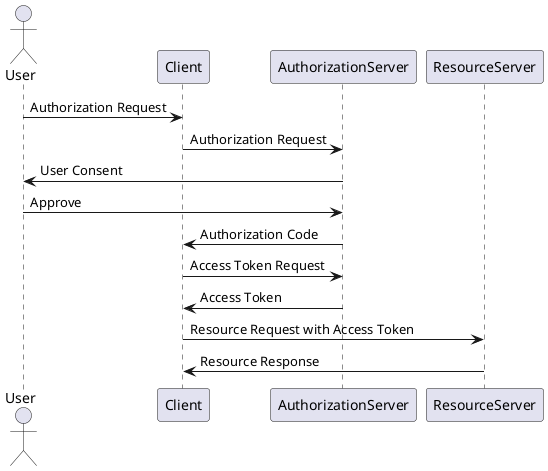
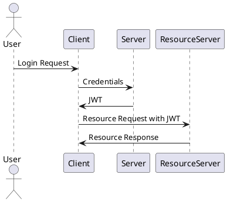

# Authentication ve Authorization Mekanizmaları

## Giriş

Bu rapor, Laravel 8 ile geliştirilmiş bir projede Authentication ve Authorization mekanizmalarını refactor etmek amacıyla Authentication ve Authorization seçeneklerini değerlendirmek üzere hazırlanmıştır. İki ana seçeneğimiz olan OAuth ve JWT yöntemleri kullanıcı kimlik doğrulama (Authentication) ve yetkilendirme (Authorization) işlemlerinde yaygın olarak kullanılmaktadır. Rapor, Authentication ve Authorization protokolleri, OAuth, JWT ve OpenID yöntemlerinin birbirlerine karşı avantajları ve dezavantajları, kullanım yerleri ve nedenleri, çalışma mekanizmaları gibi detaylı teknik bilgileri içermektedir.

## Authentication Yöntemleri ve Protokolleri

### 1. Basic Authentication

Basic Authentication, kullanıcı adı ve şifre bilgilerini bir HTTP başlığına base64 ile kodlayarak gönderme yöntemidir. username/email ve password her istek ile birlikte gönderilir.

#### Avantajları

- **Kolay Kurulum**: Uygulaması basittir ve ekstra bir altyapı gerektirmez.
- **Standartlaştırılmış**: HTTP protokolünün bir parçası olarak geniş desteklenir.

#### Dezavantajları

- **Güvenlik Riski**: Kullanıcı adı ve şifre her istekle birlikte gönderildiğinden güvenlik riskleri taşır.
- **Ölçeklenebilirlik**: Büyük ölçekli uygulamalar için uygun değildir.

### 2. Token-Based Authentication


Token-Based Authentication, kullanıcının giriş yaptıktan sonra bir token (genellikle JWT) alması ve bu token'ı her istekte Authorization başlığı içinde göndermesi esasına dayanır.

#### Avantajları

- **Stateless**: Sunucu tarafında oturum bilgisi saklanmaz, bu da ölçeklenebilirliği artırır.
- **Performans**: Tek bir doğrulama işlemi sonrası tüm istekler hızlıca doğrulanabilir.

#### Dezavantajları

- **Token Yönetimi**: Token'ların süresi dolduğunda yenilenmesi zor olabilir.
- **Güvenlik**: Token'lar çalındığında güvenlik riski oluşturabilir.

### 3. OAuth2


### Tanım

OAuth2, açık bir standart olan ve yetkilendirme için kullanılan bir protokoldür. Kullanıcının kaynaklarına erişim izni vermesini sağlamak amacıyla üçüncü taraf uygulamalara (Google, Facebook, Github, Twitter vb.) yetki verir. Buradaki yetkilendirmenin amacı kullanıcı bazlı değil, uygulama bazlı yetkilendirme yapmaktır.

### Çalışma Mekanizması

OAuth2, dört temel role dayanır:

- **Resource Owner**: Kaynak sahibi, veriyi elde eden son kullanıcıdır.
- **Client**: Kaynak sahibi adına korumalı veri kaynaklarına erişim isteyen uygulama.
- **Authorization Server**: Yetkilendirme (Authorization) ve erişimi yöneten, token dağıtımını ve doğrulamayı yapan sunucu.
- **Resource Server**: Korunan kaynaklara sahip olan sunucu.

#### OAuth2 Yetkilendirme Akışı


1. **Authorization Request**: Kullanıcı **(Resource Owner)**, istemci uygulama **(Client)** üzerinden kaynak sunucusuna **(Resource Server)** erişim izni isteği gönderir.
2. **User Consent (Authorization Grant)**: Kullanıcı, yetkilendirme sunucusu **(Authorization Server)** üzerinden erişim iznini onaylar.
3. **Authorization Code**: Yetkilendirme sunucusu **(Authorization Server)**, istemci uygulamaya **(Client)** bir yetkilendirme kodu gönderir.
4. **Access Token Request**: İstemci uygulama **(Client)**, yetkilendirme kodunu kullanarak yetkilendirme sunucusundan **(Authorization Server)** access token talep eder.
5. **Access Token Response**: Yetkilendirme sunucusu **(Authorization Server)**, access token ve refresh token (opsiyonel) ile yanıt verir.
6. **Resource Access**: İstemci uygulama **(Client)**, access token kullanarak kaynak sunucusuna **(Resource Server)** erişir.



### Avantajları

1. **Geniş Destek ve Olgunluk**: OAuth2, yaygın olarak kullanılan ve geniş destek gören bir protokoldür. Birçok büyük platform ve hizmet tarafından kullanılır.
2. **Yetkilendirme Sunucusu**: Merkezi bir yetkilendirme sunucusu kullanarak, güvenliği ve kontrolü artırır.
3. **Token Yenileme**: Access tokenlarının süresi dolduğunda refresh token kullanarak yenilenmesi mümkündür.

### Dezavantajları

1. **Uygulama Karmaşıklığı**: OAuth2'nin uygulanması, ek bileşenler gerektirdiğinden ve daha karmaşık olduğundan zaman alıcı olabilir.
2. **Performans**: Yetkilendirme sunucusuna yapılan ek istekler, performansı olumsuz etkileyebilir.

### Authorization Yapıları

- **Role-Based Authorization**: OAuth2, role-based authorization için uygundur. Access token içerisinde kullanıcı rolleri saklanarak farklı roller için farklı erişim izinleri tanımlanabilir.
- **Permission-Based Authorization**: OAuth2, permission-based authorization için de kullanılabilir. Access token içerisine kullanıcı izinleri eklenerek daha ince taneli erişim kontrolleri sağlanabilir.

### Ne Zaman Kullanılmalı?

1. **Third-Party Erişim İzni Gerektiğinde**: Eğer uygulamanız üçüncü taraf uygulamalara (örneğin, Google, Facebook) erişim izni vermek zorundaysa, OAuth2 kullanmak en mantıklı seçenektir.
2. **Merkezi Yetkilendirme Gerektiğinde**: Birden fazla uygulama veya hizmetin aynı yetkilendirme sunucusunu kullanması gerektiğinde OAuth2 uygun bir çözümdür.
3. **Token Yenileme Gerektiğinde**: Access tokenlarının süresi dolduğunda refresh token mekanizması kullanarak güvenli token yenilemesi yapmak istendiğinde. (Token-Based Authentication protokolünde yönetimi kendiniz yapmalısınız.)

### 4. OpenID Connect


OpenID Connect, OAuth2 protokolü üzerine inşa edilmiş bir Authentication katmanıdır. Kullanıcı kimliğini doğrulamak için kullanılır.

#### Çalışma Mekanizması

- End user clicks sign-in and types their username and password.
- The RP (Client) sends a request to the OpenID Provider (OP).
- The OP authenticates the User and obtains authorization.
- The OP responds with an Identity Token and usually an Access Token.
- The RP can send a request with the Access Token to the User device.
- The UserInfo Endpoint returns Claims about the End-User.

#### Avantajları

- **Kimlik Doğrulama**: Kullanıcı kimliğini doğrulamak için güçlü bir yöntem sunar.
- **Uyumluluk**: OAuth2 ile tam uyumludur.

#### Dezavantajları

- **Karmaşıklık**: Ekstra bir kimlik doğrulama katmanı ekler.
- **Kurulum Zorluğu**: Daha karmaşık kurulum ve yapılandırma gerektirir.

### Hangi Durumlarda Hangi Authentication Yöntemi Tercih Edilmeli?

- **Basic Authentication**: Küçük ve basit uygulamalar için. (Güvenli olmadığı için pek önerilmez!)
- **Token-Based Authentication**: Büyük ölçekli ve stateless uygulamalar için.
- **OAuth2**: Üçüncü taraf erişim izni gerektiren uygulamalar için.
- **OpenID Connect**: Güçlü kimlik doğrulama gerektiren uygulamalar için.

## OAuth2, JWT ve OpenID Connect İle Authentication Mekanizmaları

### OAuth2 ile Authentication

OAuth2, kullanıcıların kaynaklarına üçüncü taraf uygulamalar tarafından erişim izni vermesini sağlar. Tipik bir OAuth2 akışı aşağıdaki gibidir:

1. **Authorization Request**: Kullanıcı **(Resource Owner)**, istemci uygulama **(Client)** üzerinden kaynak sunucusuna **(Resource Server)** erişim izni isteği gönderir.
2. **User Consent (Authorization Grant)**: Kullanıcı, yetkilendirme sunucusu **(Authorization Server)** üzerinden erişim iznini onaylar.
3. **Authorization Code**: Yetkilendirme sunucusu **(Authorization Server)**, istemci uygulamaya **(Client)** bir yetkilendirme kodu gönderir.
4. **Access Token Request**: İstemci uygulama **(Client)**, yetkilendirme kodunu kullanarak yetkilendirme sunucusundan **(Authorization Server)** access token talep eder.
5. **Access Token Response**: Yetkilendirme sunucusu **(Authorization Server)**, access token ve refresh token (opsiyonel) ile yanıt verir.
6. **Resource Access**: İstemci uygulama **(Client)**, access token kullanarak kaynak sunucusuna **(Resource Server)** erişir.


### JWT ile Authentication

JWT, kullanıcı kimlik doğrulaması ve bilgi değişimi için kullanılan bir JSON tabanlı açık Token standartıdır. Dijital olarak imzalanmış JSON nesneleri şeklinde tokenlar kullanır.


#### Çalışma Mekanizması


JWT, üç ana bileşenden oluşur:

1. **Header**: Algoritma ve token tipini belirtir.
2. **Payload**: Taşınan veriyi içerir (örneğin, kullanıcı id, roller vb.).
3. **Signature**: Header ve Payload'un imzalanmasıyla oluşur.

#### JWT Oluşturma ve Kullanma

1. **Token Oluşturma**: Sunucu, kullanıcı doğrulandıktan sonra JWT oluşturur ve client'e gönderir.
2. **Token Saklama**: Client, JWT'yi yerel depolama (LocalStorage) veya cookie gibi bir yerde saklar.
3. **Token Kullanma**: Client, korunan kaynaklara erişirken JWT'yi Authorization header içinde gönderir.
4. **Token Doğrulama**: Sunucu, JWT'yi doğrular ve erişim izni verir.



#### Avantajları

1. **Taşınabilirlik ve Performans**: JWT, stateless ve taşınabilir olduğu için performans açısından avantaj sağlar. Herhangi bir merkezi sunucuya istek yapılmasına gerek kalmaz.
2. **Basitlik**: JWT'nin yapısı ve kullanımı oldukça basittir.
3. **İmza ve Şifreleme**: JWT, HMAC veya RSA ile imzalanabilir ve şifrelenebilir, bu da güvenliği artırır.

#### Dezavantajları

1. **Token Yönetimi**: JWT tokenlarının süresi dolduğunda yenilenmesi zordur. Refresh token mekanizması doğrudan desteklenmez.
2. **Güvenlik Riski**: JWT tokenları genellikle uzun ömürlüdür ve çalınmaları durumunda güvenlik riski oluşturur.

### Ne Zaman Kullanılmalı?

1. **Basit Kimlik Doğrulama Gerektiğinde**: Sadece kimlik doğrulama ve basit yetkilendirme işlemleri gerektiğinde JWT kullanılabilir.
2. **Stateless Uygulamalar**: Merkezi sunucuya bağımlı olmadan çalışan stateless uygulamalarda performans avantajı sağlar.
3. **Mikroservis Mimarileri**: Mikroservisler arasında hızlı ve güvenli bilgi alışverişi gerektiğinde JWT kullanılabilir.

#### JWT Kullanımı

- **Stateless Uygulamalar ve Mikroservisler**: Mikroservis mimarilerinde ve stateless uygulamalarda JWT kullanmak, merkezi bir sunucuya bağımlılığı ortadan kaldırır ve performans sağlar.
- **Basit Kimlik Doğrulama Gerektiğinde**: Sadece kimlik doğrulama ve basit yetkilendirme işlemleri gerektiğinde JWT kullanılabilir.

#### Access Token vs ID Token

- **Access Token**: Kaynaklara erişim sağlamak için kullanılan token türüdür. Genellikle API isteklerinde kullanılır.
- **ID Token**: Kullanıcı kimliği hakkında bilgi içeren token türüdür. Genellikle kimlik doğrulama işlemlerinde kullanılır.

OAuth2 ve JWT ile birlikte access tokenlar kullanılarak kaynaklara erişim sağlanabilirken, ID tokenlar kimlik doğrulama için kullanılır. İki token türü de belirli senaryolarda birbirini tamamlayıcı şekilde kullanılabilir.

### OpenID Connect ile Authentication

OpenID Connect, OAuth2 üzerine inşa edilmiş bir Authentication katmanıdır. Kullanıcı kimliğini doğrulamak için kullanılır. Akışı OAuth2'ye benzer ancak ekstra bir kimlik doğrulama katmanı ekler.

1. **Authorization Request**: Kullanıcı **(Resource Owner)**, istemci uygulama **(Client)** üzerinden kaynak sunucusuna **(Resource Server)** erişim izni isteği gönderir.
2. **User Consent (Authorization Grant)**: Kullanıcı, yetkilendirme sunucusu **(Authorization Server)** üzerinden erişim iznini onaylar.
3. **Authorization Code**: Yetkilendirme sunucusu **(Authorization Server)**, istemci uygulamaya **(Client)** bir yetkilendirme kodu gönderir.
4. **Access Token Request**: İstemci uygulama **(Client)**, yetkilendirme kodunu kullanarak yetkilendirme sunucusundan **(Authorization Server)** access token talep eder.
5. **Access Token Response**: Yetkilendirme sunucusu **(Authorization Server)**, access token ve ID token ile yanıt verir.
6. **User Info Request**: İstemci uygulama **(Client)**, ID token kullanarak kullanıcı bilgilerini doğrular.

## Authorization Yöntemleri ve Protokolleri

### 1. Role-Based Authorization

Role-Based Authorization (RBA), kullanıcılara belirli roller atayarak bu roller doğrultusunda erişim izinleri tanımlanması yöntemidir.

#### Avantajları

- **Kolay Yönetim**: Roller üzerinden erişim kontrolü sağlanması, yönetimi kolaylaştırır.
- **Geniş Kullanım Alanı**: Birçok uygulamada standart olarak kullanılır.

#### Dezavantajları

- **Esneklik Eksikliği**: Daha ince taneli erişim kontrolü gerektiren senaryolarda yetersiz kalabilir.

### 2. Permission-Based Authorization

Permission-Based Authorization (PBA), kullanıcılara belirli izinler tanımlayarak bu izinler doğrultusunda erişim kontrolü sağlama yöntemidir.

#### Avantajları

- **Esneklik**: Daha ince taneli erişim kontrolü sağlar.
- **Güçlü Güvenlik**: Daha detaylı izin tanımları ile güvenliği artırır.

#### Dezavantajları

- **Yönetim Zorluğu**: İzinlerin yönetimi ve takibi daha karmaşık olabilir.
- **Karmaşıklık**: Daha fazla yapılandırma gerektirir.

### OAuth, JWT ve OpenID Connect ile Authorization Mekanizmaları

#### OAuth ile Authorization

OAuth2, role-based veya permission-based authorization için kullanılabilir. Access token içerisinde kullanıcı rolleri veya izinleri saklanarak farklı erişim kontrolleri tanıml

anabilir.

#### JWT ile Authorization

JWT payload içerisine roller veya izinler eklenerek role-based veya permission-based authorization sağlanabilir. JWT'nin taşınabilir ve stateless yapısı, mikroservis mimarilerinde avantaj sağlar.

#### OpenID Connect ile Authorization

OpenID Connect, kimlik doğrulama ile birlikte authorization için de kullanılabilir. ID token içerisinde kullanıcı bilgileri ve izinler saklanabilir.

## Authentication ve Authorization Yöntemlerinin Birlikte Kullanımı

- **OAuth2 ve JWT**: OAuth2 access tokenları JWT formatında olabilir. Bu, OAuth2'nin avantajlarını (merkezi yetkilendirme, token yenileme) ve JWT'nin avantajlarını (stateless, performans) bir araya getirir.
- **OpenID Connect ve OAuth2**: OpenID Connect, OAuth2 üzerine inşa edilmiştir ve kimlik doğrulama ile yetkilendirme işlemlerini birlikte sunar.
- **Role-Based ve Permission-Based Authorization**: Role-based ve permission-based authorization yöntemleri birlikte kullanılabilir. Kullanıcılar, belirli roller ve bu roller doğrultusunda izinler alabilir.

## Laravel Sanctum ve Laravel Passport

### Laravel Sanctum

Sanctum, Laravel'in SPA (Single Page Application) ve basit token tabanlı API doğrulama için kullanılan bir pakettir.

#### Kurulum

```bash
composer require laravel/sanctum
php artisan vendor:publish --provider="Laravel\Sanctum\SanctumServiceProvider"
php artisan migrate
```

#### Konfigürasyon

`config/sanctum.php` dosyasında ayarlar yapılabilir. `api` middleware grubuna `EnsureFrontendRequestsAreStateful` middleware'i eklenmelidir.

#### Kullanım

Sanctum ile kullanıcı giriş yaparken bir token oluşturulur ve bu token kullanılarak API istekleri yapılır.

```php
// Token oluşturma
$user = User::find(1);
$token = $user->createToken('token-name')->plainTextToken;

// Token ile API isteği yapma
$response = Http::withToken($token)->get('/api/user');
```

#### Avantajları

1. **Kolay Kurulum**: Sanctum, kurulumu ve kullanımı oldukça basittir.
2. **CSRF Koruması**: SPA'ler için CSRF koruması sağlar.
3. **Lightweight**: Ağır bir yetkilendirme sunucusuna ihtiyaç duymaz.

#### Dezavantajları

1. **Sınırlı Yetkilendirme**: Daha karmaşık yetkilendirme senaryoları için uygun olmayabilir.

### Laravel Passport

Passport, Laravel'in OAuth2 sunucusu olarak çalışan ve tam özellikli API yetkilendirme sunucusu sağlayan bir pakettir.

#### Kurulum

1. Öncelikle Laravel Passport'u projemize ekleyelim:

```bash
composer require laravel/passport
```

2. Ardından Passport'un gerekli dosyalarını yayımlayıp veritabanını migration ile güncelleyelim:

```bash
php artisan vendor:publish --tag=passport-migrations
php artisan migrate
php artisan passport:install
```

3. `config/auth.php` dosyasında `api` guard'ının driver'ı `passport` olarak ayarlayalım:

```php
'guards' => [
    'api' => [
        'driver' => 'passport',
        'provider' => 'users',
    ],
],
```

4. `App\Providers\AuthServiceProvider` dosyasına Passport::routes() metodunu ekleyelim:

```php
use Laravel\Passport\Passport;

public function boot()
{
    $this->registerPolicies();

    Passport::routes();
}
```

#### Kullanım

Passport ile kullanıcı giriş yaparken bir access token oluşturulur ve bu token kullanılarak API istekleri yapılır.

```php
// Token oluşturma
use Laravel\Passport\HasApiTokens;

class User extends Authenticatable
{
    use HasApiTokens, Notifiable;
}

// Token ile API isteği yapma
$response = Http::withToken($token)->get('/api/user');
```

Passport tarafından oluşturulan token'ları kullanarak API isteklerini yetkilendirebilirsiniz:

```php
Route::middleware('auth:api')->get('/user', function (Request $request) {
    return $request->user();
});
```

#### Avantajları

1. **Tam Özellikli OAuth2**: OAuth2'nin tüm özelliklerini destekler.
2. **Güçlü Güvenlik**: Access ve refresh token kullanarak güçlü güvenlik sağlar.
3. **Kolay Entegrasyon**: Laravel ile kolayca entegre olur.

#### Dezavantajları

1. **Karmaşıklık**: Daha karmaşık kurulum ve yapılandırma gerektirir.
2. **Performans**: Merkezi yetkilendirme sunucusu nedeniyle performans düşebilir.

### Sanctum vs Passport

#### Hangi Durumda Hangi Yöntem Tercih Edilmeli?

- **Sanctum**: Basit kimlik doğrulama ve SPA projeleri için idealdir.
- **Passport**: Karmaşık yetkilendirme senaryoları ve üçüncü taraf erişim izinleri gereken projeler için uygundur.

#### Sanctum Kısıtlamaları

1. **Yalnızca Basit Senaryolar İçin**: Sanctum, yalnızca basit kimlik doğrulama senaryoları için uygundur. Karmaşık yetkilendirme ihtiyaçları için yeterli değildir.
2. **CSRF Koruması Yalnızca SPA'ler İçin**: Sanctum, CSRF koruması sağlar, ancak bu koruma yalnızca SPA'ler için geçerlidir. Diğer uygulamalar için ek güvenlik önlemleri gerekebilir.
3. **Refresh Token Desteği Yok**: Sanctum, refresh token desteği sunmaz. Token yönetimini manuel olarak yapmak zorunda kalabilirsiniz.

#### Passport Kısıtlamaları

1. **Karmaşık Kurulum**: Passport, daha karmaşık bir kurulum ve yapılandırma gerektirir. Bu da başlangıçta daha fazla zaman ve çaba gerektirir.
2. **Merkezi Yetkilendirme Sunucusu**: Passport, merkezi bir yetkilendirme sunucusu gerektirir. Bu, ölçeklenebilirlik ve performans üzerinde olumsuz etkiler yaratabilir.
3. **Üçüncü Taraf Entegrasyonlar**: Passport, üçüncü taraf uygulamalarla entegrasyon için OAuth2'yi kullanır. Bu da ekstra yapılandırma ve yönetim gerektirir.

#### Örnek Uygulamalar

##### Sanctum ile Role-Based Authorization

```php
// Middleware
public function handle($request, Closure $next)
{
    if (! $request->user()->hasRole('admin')) {
        return response()->json(['error' => 'Unauthorized'], 403);
    }

    return $next($request);
}

// Kullanıcı modeli
public function hasRole($role)
{
    return $this->role === $role;
}
```

##### Passport ile Permission-Based Authorization

```php
// Middleware
public function handle($request, Closure $next)
{
    if (! $request->user()->hasPermission('edit-posts')) {
        return response()->json(['error' => 'Unauthorized'], 403);
    }

    return $next($request);
}

// Kullanıcı modeli
public function hasPermission($permission)
{
    return $this->permissions()->contains('name', $permission);
}
```

### Laravel Passport ile AOP Teknikleriyle Merkezi ve Generic Role-Based ve Permission-Based Authorization

Bu bölümde, Aspect-Oriented Programming (AOP) teknikleri kullanarak role-based ve permission-based yetkilendirme işlemlerini nasıl merkezi ve generic hale getirebileceğimizi anlatacağız.

#### Role ve Permission Tanımları

Role ve permission tanımlamalarını, controller veya model düzeyinde tanımlayabiliriz. Aşağıda bir örnek gösterilmektedir:

```php
// User.php
public function roles()
{
    return $this->belongsToMany(Role::class);
}

public function permissions()
{
    return $this->belongsToMany(Permission::class);
}
```

#### Role ve Permission Middleware'leri

Generic bir middleware yapısı oluşturmak için aşağıdaki adımları izleyin:

##### Role-Based Middleware

```php
// CheckRole.php
namespace App\Http\Middleware;

use Closure;
use Illuminate\Support\Facades\Auth;

class CheckRole
{
    public function handle($request, Closure $next, $role)
    {
        if (!Auth::user()->hasRole($role)) {
            return response()->json(['error' => 'Unauthorized'], 403);
        }

        return $next($request);
    }
}

// User.php
public function hasRole($role)
{
    return $this->roles()->where('name', $role)->exists();
}
```

##### Permission-Based Middleware

```php
// CheckPermission.php
namespace App\Http\Middleware;

use Closure;
use Illuminate\Support\Facades\Auth;

class CheckPermission
{
    public function handle($request, Closure $next, $permission)
    {
        if (!Auth::user()->hasPermission($permission)) {
            return response()->json(['error' => 'Unauthorized'], 403);
        }

        return $next($request);
    }
}

// User.php
public function hasPermission($permission)
{
    return $this->permissions()->where('name', $permission)->exists();
}
```

#### Middleware Kullanımı

Middleware'leri route'larda veya controller'larda kullanabilirsiniz:

```php
// web.php
Route::middleware(['auth', 'checkRole:admin'])->group(function () {
    Route::get('/admin', function () {
        return view('admin.dashboard');
    });
});

Route::middleware(['auth', 'checkPermission:edit-posts'])->group(function () {
    Route::get('/edit', function () {
        return view('edit.post');
    });
});
```

## Sonuç

Her iki yöntem de kullanıcı kimlik doğrulama ve yetkilendirme işlemlerinde güçlü seçenekler sunmaktadır. Seçim, projenizin özel ihtiyaçlarına ve kullanım senaryolarına bağlı olacaktır:

- **OAuth2**, daha karmaşık yetkilendirme senaryoları ve üçüncü taraf erişim izinleri için daha uygun olabilir.
- **JWT**, daha basit kimlik doğrulama ve bilgi değişim ihtiyaçları için performans ve taşınabilirlik avantajları sunar.
- **Sanctum**, basit ve hızlı kurulum gerektiren projeler için idealdir.
- **Passport**, güçlü güvenlik ve geniş yetkilendirme ihtiyaçları için uygundur.

## Kaynaklar

- [OAuth2](https://oauth.net/2/)
- [JWT](https://jwt.io/)
- [OpenID Connect](https://openid.net/connect/)
- [Laravel Sanctum](https://laravel.com/docs/8.x/sanctum)
- [Laravel Passport](https://laravel.com/docs/8.x/passport)
- [RFC 6749: The OAuth 2.0 Authorization Framework](https://tools.ietf.org/html/rfc6749)
- [RFC 7519: JSON Web Token (JWT)](https://tools.ietf.org/html/rfc7519)
- [RFC 7636: Proof Key for Code Exchange by OAuth Public Clients](https://tools.ietf.org/html/rfc7636)
