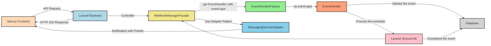
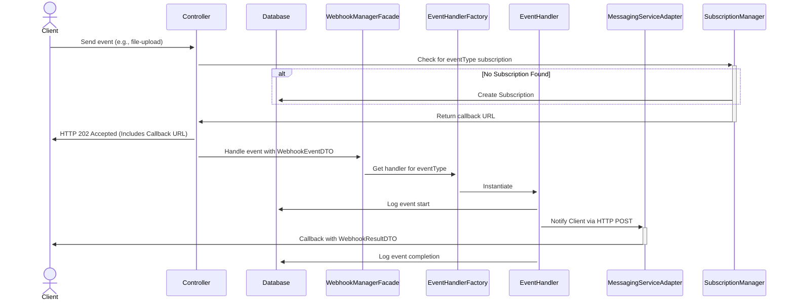
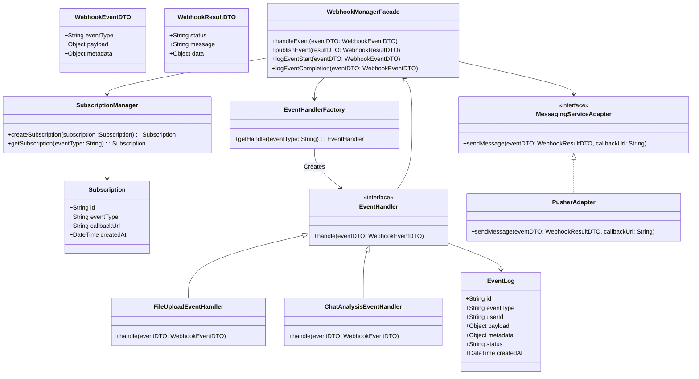

# Comprehensive System Design Architecture for Webhook - Event Driven System

## Table of Contents

- [Comprehensive System Design Architecture for Webhook - Event Driven System](#comprehensive-system-design-architecture-for-webhook---event-driven-system)
  - [Table of Contents](#table-of-contents)
  - [Introduction](#introduction)
  - [Functional Requirements](#functional-requirements)
  - [Non-Functional Requirements](#non-functional-requirements)
  - [System Overview](#system-overview)
  - [Design Goals](#design-goals)
  - [System Architecture](#system-architecture)
    - [Event-Driven Architecture and Webhooks](#event-driven-architecture-and-webhooks)
      - [What is EDA?](#what-is-eda)
      - [Implementation and Components](#implementation-and-components)
      - [Integration of EDA with Webhooks](#integration-of-eda-with-webhooks)
    - [System Components](#system-components)
    - [Design Principles and Patterns](#design-principles-and-patterns)
    - [Data Flow](#data-flow)
    - [UML Class Diagrams](#uml-class-diagrams)
      - [DTOs, Classes, Services, Design Patterns, DB Tables and Models/Entities](#dtos-classes-services-design-patterns-db-tables-and-modelsentities)
    - [Functions Explanation (App/Call-Flow diagram)](#functions-explanation-appcall-flow-diagram)
  - [Technical Decisions](#technical-decisions)
  - [Conclusion](#conclusion)

## Introduction

In the rapidly evolving digital landscape, the need for real-time, efficient, and scalable systems has become paramount. Our initiative to develop a Webhook - Event Driven System stems from the critical requirement to bridge the gap between event production and consumption without the overhead of constant polling or manual intervention. This system is designed to address key use-cases like asynchronous file uploads, real-time chat analysis, and dynamic notification delivery, which are integral to our operational efficiency and user engagement strategies. Future enhancements may include integration with more external services, support for a broader range of event types, and advanced analytics capabilities.

## Functional Requirements

The system is engineered to meet the following functional requirements, tailored to our current needs and anticipated future expansions:

- **Real-Time Event Notification**: Immediate notification of subscribers upon event occurrences, eliminating latency and manual checking.
- **Asynchronous Event Processing**: The system must be capable of processing events such as file uploads and chat analysis asynchronously.
- **Dynamic Event Subscription**: Clients should be able to subscribe to specific event types dynamically, with the ability to specify callback URLs for notifications.
- **Scalable Notification Mechanism**: The system must support a scalable mechanism for notifying subscribers about event outcomes.
- **Broad Event Coverage**: From user-generated events like file uploads to system events such as service downtimes, the system must handle a diverse range of events.

## Non-Functional Requirements

- **Scalability**: The system should handle increasing loads by scaling horizontally.
- **Reliability**: It must process events and deliver notifications reliably, with minimal downtime.
- **Flexibility**: The architecture should accommodate new event types and messaging services without significant reconfiguration.
- **Security**: Event data and notifications should be transmitted securely, protecting sensitive information.

## System Overview

Our Webhook - Event Driven System employs an Event-Driven Architecture (EDA) complemented by webhook mechanisms to foster asynchronous communication and processing. This design decouples the event producers from the consumers, enabling a more scalable and flexible infrastructure that can adapt to changing demands and integrate seamlessly with a multitude of services and platforms.

## Design Goals

- **Efficiency**: Process events efficiently to minimize latency.
- **Adaptability**: Easily integrate new event types and external services.
- **Maintainability**: Facilitate easy maintenance and updates through clear separation of concerns and use of design patterns.
- **Decoupling**: Use an Adapter Pattern to minimize dependency on specific third-party services (e.g., Pusher) for future flexibility.

## System Architecture

### Event-Driven Architecture and Webhooks

#### What is EDA?

Event-Driven Architecture is a design paradigm where the flow of the program is determined by events or changes in state. This architecture allows different parts of a system to communicate and perform actions asynchronously, promoting loose coupling and enhanced scalability.

#### Implementation and Components

In our implementation, EDA is realized through the use of webhooks, which are user-defined HTTP callbacks triggered by specific events. Key components include:

- **Event Producers**: Components that generate events, such as user actions or system alerts.
- **Event Router**: Directs events to the appropriate handlers based on subscription data.
- **Event Handlers**: Services or functions designed to respond to specific types of events.
- **Subscribers**: External systems or services that register to receive notifications about events.

#### Integration of EDA with Webhooks

By integrating EDA with webhooks, we've created a dynamic system where events are efficiently routed from producers to subscribers. This integration solves the problem of real-time data transmission without requiring subscribers to continuously poll for updates, thereby reducing network traffic and improving system responsiveness.

### System Components

- **Next.js Frontend (Client/Subscriber)**: Initiates operations and subscribes to notifications for operation completions.
- **Laravel Backend (Server/Publisher)**: Processes requests asynchronously and publishes event notifications through `WebhookManager`.
- **WebhookManagerFacade**: Orchestrates event handling, including subscription management and notification dispatch.
- **SubscriptionManager**: Manages dynamic event subscriptions and stores callback URLs.
- **EventHandlerFactory**: Creates specific handlers for different event types using the Factory pattern.
- **Queue/Job System**: Handles asynchronous processing of tasks in the Laravel backend.
- **MessagingServiceAdapter**: Abstracts messaging service integration, allowing for flexibility in notification delivery methods.

### Design Principles and Patterns

- **Observer Pattern**: Allows for dynamic subscription to events and notification of subscribers.
- **Factory Pattern**: Dynamically creates event handlers based on the event type.
- **Adapter Pattern**: Facilitates integration with various messaging services like Pusher for event notification delivery.

### Data Flow

1. The frontend sends an API request to the backend.
2. The backend processes the request asynchronously, using a queue/job system. It immediately responds with HTTP 202 and a webhook callback URL.
3. The WebhookManager utilizes an adapter to abstract messaging service interactions.
4. Upon completion of the task, the WebhookManager triggers the webhook.
5. The client receives the webhook notification and updates the user interface accordingly.

### UML Class Diagrams

#### DTOs, Classes, Services, Design Patterns, DB Tables and Models/Entities

### Functions Explanation (App/Call-Flow diagram)

The system's flow initiates with the client sending a request. The `Controller` checks for an existing subscription via `SubscriptionManager`, which returns a callback URL. The `WebhookManagerFacade` is then tasked with handling the event, using `EventHandlerFactory` to get the appropriate handler based on the event type. Once processed, `MessagingServiceAdapter` notifies the client of the outcome.

## Technical Decisions

- **Laravel Queue/Job**: Utilized for processing events asynchronously, ensuring system responsiveness and scalability.
- **Design Pattern Adoption**: Observer, Factory, and Adapter patterns enhance the system's flexibility, maintainability, and integration capability with external services.
- **Security Measures**: Secure transmission of data and adherence to best practices in handling sensitive information.
- **Use of DTOs**: Ensures a consistent structure for event data across the system, simplifying serialization, validation, and processing.
- **Centralized Webhook Management**: Simplifies adding new event types and managing subscriptions.

## Conclusion

Our Webhook - Event Driven System is designed to be scalable, reliable, and flexible, capable of processing events efficiently and notifying subscribers through a well-structured, event-driven architecture. The adoption of design patterns and a clear separation of concerns facilitate easy maintenance and future expansion, ensuring the system can adapt to new requirements and integrate seamlessly with a variety of messaging services.
